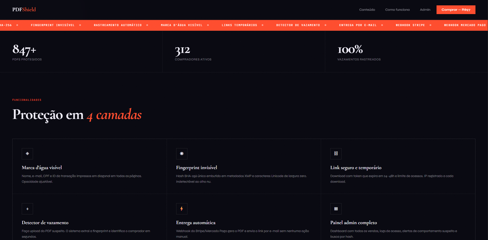
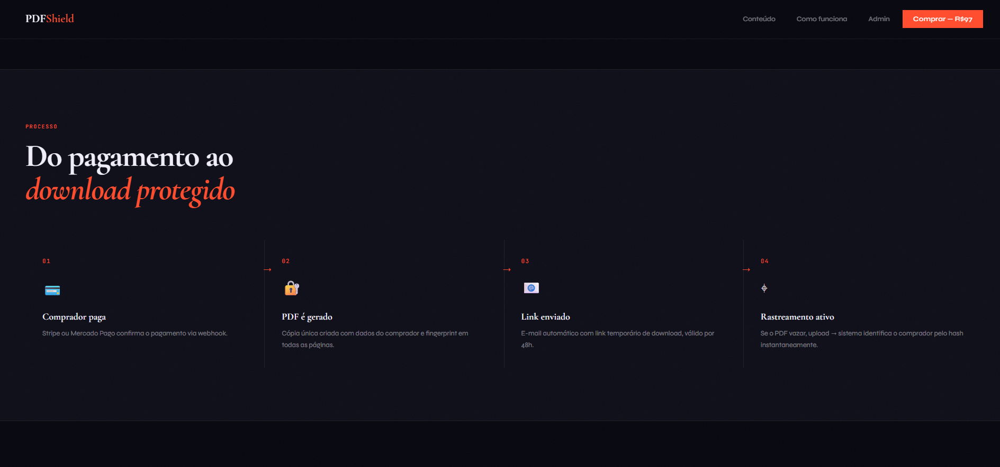
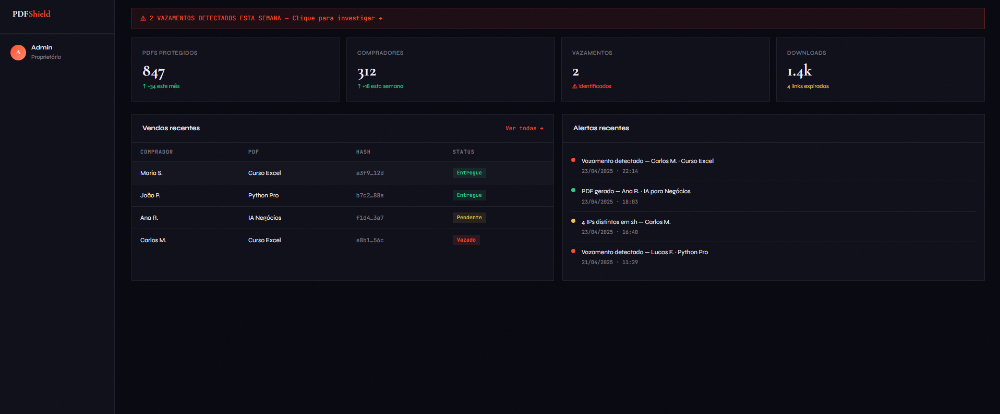
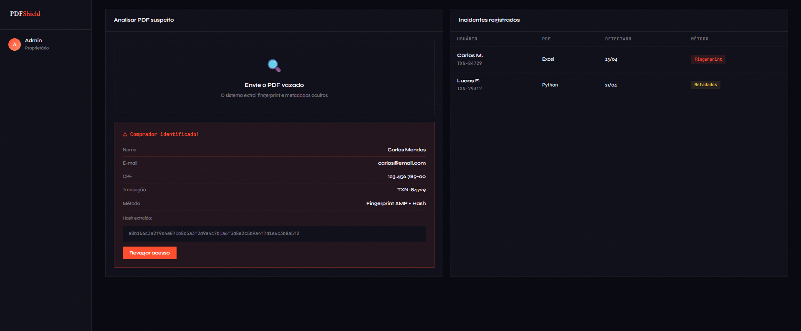
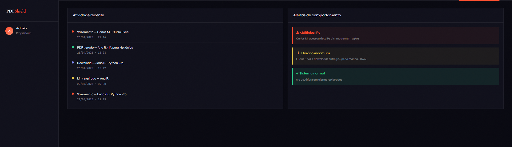
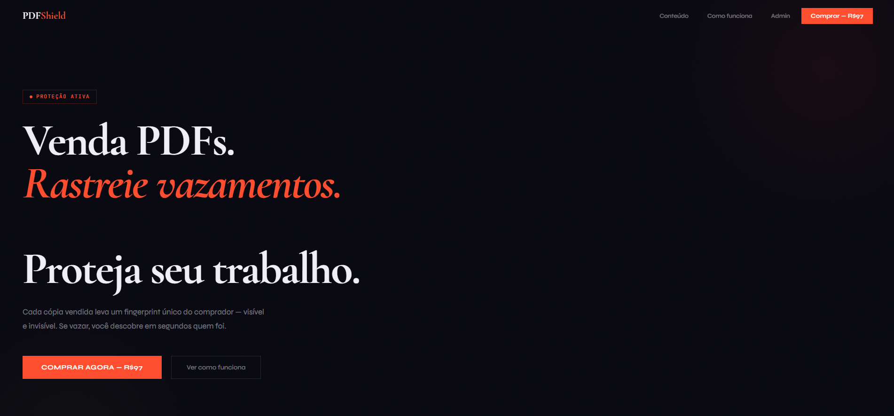

# PDFShield 🛡


Bem-vindo ao meu projeto. O PDFShield é um sistema que estou desenvolvendo em Python para resolver um problema real: a pirataria de e-books e infoprodutos.

Se alguém compra um livro digital e decide compartilhá-lo ilegalmente na internet, o PDFShield consegue descobrir quem foi. Ele faz isso carimbando o PDF com marcas d'água visíveis e também com rastreadores escondidos no código do arquivo, baseados nos dados de quem comprou (como Nome e e-mail).

📌 Nota de Estudante: Este é o meu primeiro grande projeto no GitHub! Ele nasceu do meu desejo de aprender mais sobre manipulação de arquivos binários, segurança de dados e integrações de backend com APIs de pagamento. O projeto ainda está em andamento e pretendo evoluí-lo muito mais.

💡 O que o projeto já faz?
Rastreamento Invisível: Converte as informações do comprador em caracteres invisíveis e insere-os no meio do texto do PDF. Mesmo que a pessoa apague as marcas visíveis, o rastreador continua lá se o texto for copiado.

Marcas d'água: Cria overlays bonitos e diagonais dizendo "Uso Exclusivo de [Nome do Comprador]".

Simulador de Pagamentos: Já está preparado com a lógica para receber avisos automáticos (Webhooks) do Stripe e Mercado Pago quando uma venda for aprovada.

Detetor de Fugas: Tem uma aba onde o administrador coloca o PDF que foi vazado e o sistema faz uma varredura para revelar os dados do comprador original na hora.

🛠️ Como testar no teu computador (Muito fácil!)
Para facilitar os meus testes e permitir que qualquer pessoa veja o projeto a funcionar sem precisar de configurar bancos de dados complexos ou Docker, criei um servidor local super leve que roda direto no terminal.

1. Instala as duas bibliotecas necessárias:
Bash
pip install reportlab pypdf
2. Executa o teste automatizado:
Este script simula uma compra inteira, gera o PDF e testa se o detetor de vazamentos está a funcionar:

Bash
python testar_local.py
3. Abre o Painel no Navegador:
Queres ver o visual? Executa este comando:

Bash
python server_local.py
Agora abre o teu navegador em http://localhost:8000. Criei um painel interativo onde podes fazer upload de um PDF e ver a mágica acontecer!

📈 Próximos Passos (O que pretendo implementar)
Como o projeto está em desenvolvimento, as minhas próximas metas de estudo são:

Conectar a API (FastAPI) ao banco de dados PostgreSQL (já criei o arquivo init.sql, agora falta integrá-lo ao código Python).

Substituir os dicionários temporários em memória por salvamento real no banco de dados.

Criar uma interface frontend mais robusta.

✉️ Feedback: Se tiveres alguma sugestão de melhoria no código ou na segurança, deixa uma Issue ou entra em contacto. Estou aqui para aprender!

## Screenshots

### 🖥️ Landing Page
Interface limpa focada na conversão e apresentação da proposta de valor do produto.


### ⚙️ Como Funciona
Seção interativa explicando visualmente o processo de proteção em camadas para o cliente final.


### 📊 Painel Administrativo
Dashboard do infoprodutor com métricas de vendas, faturamento e status dos arquivos.


### 🎯 Painel de Rastreamento (Detecção de Vazamentos)
Área onde o administrador faz o upload do PDF suspeito para identificar o comprador original.


### 🪵 Logs do Sistema
Histórico em tempo real de tentativas de download, geração de tokens e eventos de auditoria.


### 📦 Página do Produto
Fluxo de checkout direto focado na experiência do usuário antes do redirecionamento de pagamento.


---

## Estrutura do projeto

```
pdfshield/
├── backend/
│   ├── app/
│   │   ├── main.py          ← API FastAPI (todos os endpoints)
│   │   ├── pdf_engine.py    ← Motor de fingerprint e marca d'água
│   │   ├── email_service.py ← Resend / SendGrid
│   │   └── payments.py      ← Stripe + Mercado Pago
│   ├── requirements.txt
│   ├── Dockerfile
│   └── .env.example         ← Copiar para .env
├── frontend/
│   ├── pages/
│   │   ├── index.tsx        ← Página de venda
│   │   ├── minha-conta.tsx  ← Dashboard do comprador
│   │   └── api/
│   │       ├── checkout.ts  ← Cria sessão Stripe
│   │       ├── pix.ts       ← Preferência Mercado Pago
│   │       └── purchase.ts  ← Detalhes da compra
│   ├── Dockerfile
│   ├── next.config.js
│   └── .env.example         ← Copiar para .env.local
├── scripts/
│   └── init.sql             ← Schema PostgreSQL (auto-executado)
├── docker-compose.yml       ← Sobe tudo com 1 comando
└── README.md
```

---

## Deploy em 5 minutos

### 1. Clonar e configurar variáveis

```bash
git clone <seu-repo> pdfshield && cd pdfshield

# Backend
cp backend/.env.example backend/.env
# Editar backend/.env com suas chaves

# Frontend
cp frontend/.env.example frontend/.env.local
# Editar frontend/.env.local com suas chaves
```

### 2. Subir tudo com Docker

```bash
docker-compose up -d --build
```

Isso inicia:
- **Backend** → http://localhost:8000 (Swagger: /docs)
- **Frontend** → http://localhost:3000
- **PostgreSQL** → localhost:5432

### 3. Fazer upload do seu PDF

```bash
curl -X POST http://localhost:8000/api/pdfs/upload \
  -F "file=@seu-curso.pdf"
# Retorna: {"pdf_id": "uuid-aqui", ...}
```

Copiar o `pdf_id` e colar no `NEXT_PUBLIC_DEFAULT_PDF_ID` do `.env.local`.

### 4. Configurar webhooks

**Stripe:**
1. Dashboard → Developers → Webhooks
2. Endpoint: `https://seudominio.com/api/webhook/stripe`
3. Eventos: `checkout.session.completed`
4. Copiar signing secret → `STRIPE_WEBHOOK_SECRET`

**Mercado Pago:**
1. Dashboard → Integrações → Notificações IPN
2. URL: `https://seudominio.com/api/webhook/mercadopago`
3. Tópicos: `payment`

### 5. Domínio e HTTPS (Railway ou VPS)

**Railway (mais simples):**
```bash
npm install -g @railway/cli
railway login && railway init
railway add postgresql
railway up
```

**VPS com Nginx + Let's Encrypt:**
```bash
# nginx.conf (simplificado)
server {
    listen 443 ssl;
    server_name seudominio.com;
    location /api { proxy_pass http://localhost:8000; }
    location /     { proxy_pass http://localhost:3000; }
}
```

---

## 🔄 Fluxo Completo de Venda e Proteção

```
sequenceDiagram
    autonumber
    actor C as Comprador
    participant F as Frontend (Next.js)
    participant B as Backend (FastAPI)
    participant G as Gateway (Stripe/MP)
    
    C->>F: Insere Nome, E-mail e CPF
    F->>G: Cria Sessão de Checkout
    G->>C: Exibe Tela de Pagamento
    C->>G: Efetua o Pagamento
    G->>B: Dispara Webhook (Aprovado)
    Note over B: Motor processa em memória RAM<br/>Injeta marcas d'água e ZWC invisível
    B->>C: Envia E-mail com Link Temporário (48h)
    C->>B: Clica no Link e descarrega o PDF Protegido
```

## Detectar vazamento

```bash
curl -X POST http://localhost:8000/api/pdfs/detect-leak \
  -F "file=@pdf_suspeito.pdf"
# Retorna: comprador identificado + método de detecção
```

---

## Variáveis de ambiente

| Variável | Descrição |
|----------|-----------|
| `STRIPE_SECRET_KEY` | Chave secreta do Stripe |
| `STRIPE_WEBHOOK_SECRET` | Signing secret do webhook Stripe |
| `MP_ACCESS_TOKEN` | Access Token do Mercado Pago |
| `RESEND_API_KEY` | API key do Resend (e-mails) |
| `EMAIL_FROM` | Remetente dos e-mails |
| `BASE_URL` | URL pública do site |
| `DATABASE_URL` | Connection string PostgreSQL |

---

## Tecnologias

| Camada | Tecnologia |
|--------|-----------|
| Backend | Python 3.12 + FastAPI |
| PDF | reportlab + pypdf |
| Frontend | Next.js 14 + TypeScript |
| Banco | PostgreSQL 16 |
| Pagamento | Stripe + Mercado Pago |
| E-mail | Resend ou SendGrid |
| Deploy | Docker + Railway/VPS |
